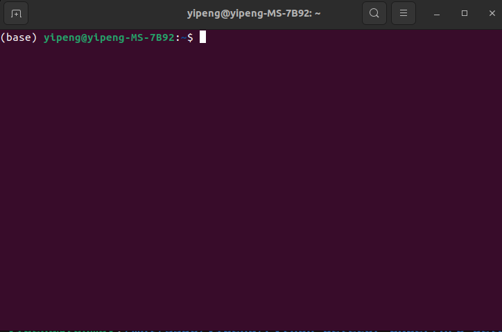
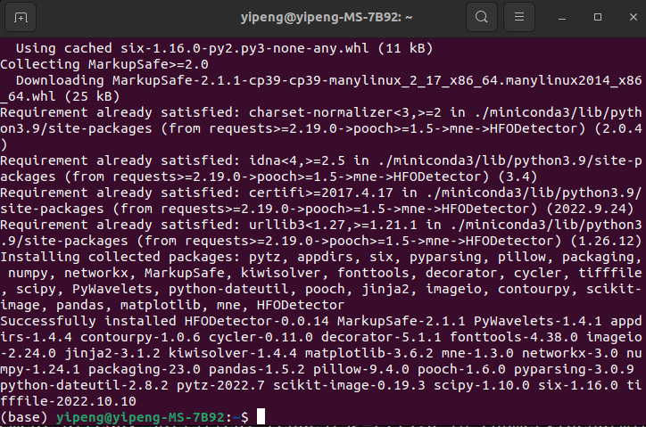
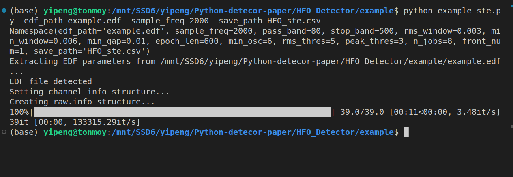

# Tutorial
## Step by step tutorial on setting up HFO detector in your machine
### **1. Installation and environment:**
The detector is running under python environment. For running a python script, we recommend to use conda enviroment. We will provide examples in Mac OS/Linux machine. For windows machine it is very similar and you can easily to find tutorial online. 

For installing conda environment, please follow this [link](https://developers.google.com/earth-engine/guides/python_install-conda#linux_1). 

After install the conda envicoment, open your terminal and you can see it has a **(base)** in the front of the terminal line. (You can create your own environment but here we just use base for simplicity). 



Then you can install the HFO detetor by typing:

```
pip install HFODetector
```

You will have this page when the installation is successful



---

### **2. Run the detectors**

We provide two ways to run the detector, by [jupyter notebook](https://code.visualstudio.com/docs/datascience/jupyter-notebooks) and plain *.py* script. The example files can be found in *example/example.ipynb* and *example/example_{detector_name}.py*. We recommend to install pandas to better visualize and manupilate the results. 

```
pip install pandas
```

### **2.1 Run detectors using juputer notebook**

Please open *example/example.ipynb* and it has all instructions. 

### **2.2 Run detectors using python script**

2.2.1 Simple version

```
python example_ste.py -edf_path example.edf -sample_freq 2000
```

2.2.2 With saved path
```
python example_ste.py -edf_path example.edf -sample_freq 2000 -save_path HFO_ste.csv
```



The result csv will be saved in the same directory of the example_ste.py but you can also specify your own path.

2.2.3 Multi-processing using 8 processors

```
python example_ste.py -edf_path example.edf -sample_freq 2000 -save_path HFO_ste.csv -n_jobs 8
```

2.2.4 Full version:

```
python example_ste.py -edf_path example.edf -sample_freq 2000 -save_path HFO_ste.csv -fp 80 -fs 500 -rw 3e-3 -mw 6e-6 -mg 10e-3 -el 600 -mo 6 -rt 5 -pt 3 -n_jobs 8 
```

Same steps can be done for MNI detector, by using example_mni.py